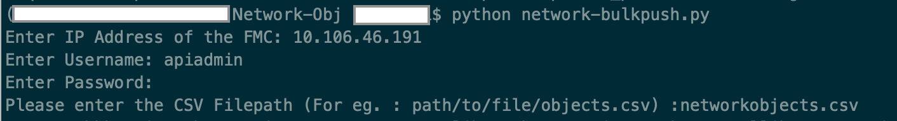
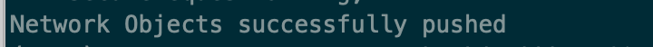
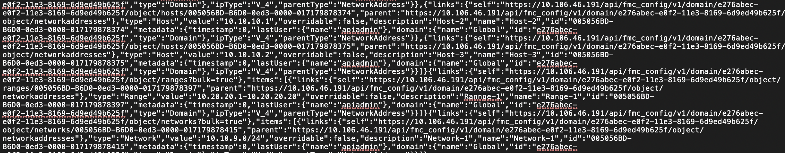

# Bulk Push Objects FMC

[](https://developer.cisco.com/codeexchange/github/repo/shubhambharti89/BulkPushObjectsFMC)

API workflow to push objects in Bulk to FMC. This script has been tested with FMC version 6.4 and above and should be able to run on any machine with required modules present. 

To read more about the functioning of this script, please read : https://www.cisco.com/c/en/us/support/docs/security/firepower-management-center/215972-push-objects-in-bulk-to-fmc-using-rest-a.html

The limit of Bulk push is : 

- Payload can't contain more than 1,000 entries.
  
- Payload size can't be more than 2MB - You can check the size of CSV file for estimation. 

Below are the object names which FMC does not accept

- Name of the object is grater than 64 char

- There should not be a space at the beginning of the object name and not semi colon at end


All REST requests will be logged in these two log files on FMC. Search for your url (ex. .../object/hosts) with correct operation(If you are looking for error for GET operation, ensure that your log starts something like 'GET ...object/hosts'). 

```
  /var/opt/CSCOpx/MDC/tomcat/logs/stdout.logs
  
  /var/opt/CSCOpx/MDC/log/operation/usmsharedsvcs.log
```

This workflow requires CSV File as an input - Sample CSV file is provided in this folder itself. Fill the CSV file with required input and run any of the script present in respective folder. 



Once the required details are provided, the output is seen as below(This is just an example):



This script also provides you with a log file in the same folder with success and failure responses. 




### Network Objects Bulk Push
 
 This API workflow can push all three types of network objects in bulk to the FMC:
 
 - Host objects
  
 - Network Objects
  
 - Range Objects

Fill the CSV file with required input and run the "network-bulkpush.py"


### Port Objects Bulk Push 

This API workflow can push all three types of port objects in bulk to the FMC:

 - TCP/UDP Port objects

 - ICMPv4 Objects - Please make sure the ICMP type and code have bee validated.

 - ICMPv6 Objects - Please make sure the ICMP type and code have bee validated.


Fill the CSV file with required input and run the "port-bulkpush.py"

### URL Objects Bulk Push 

This API workflow can push URL objects in bulk to the FMC.

Fill the CSV file with required input and run the "url-bulkpush.py"


